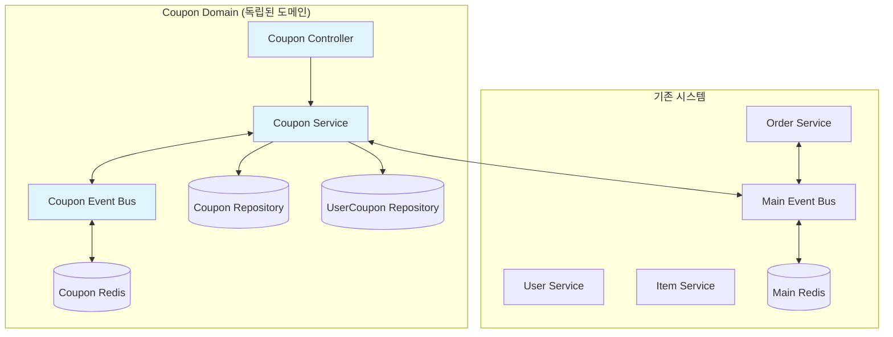
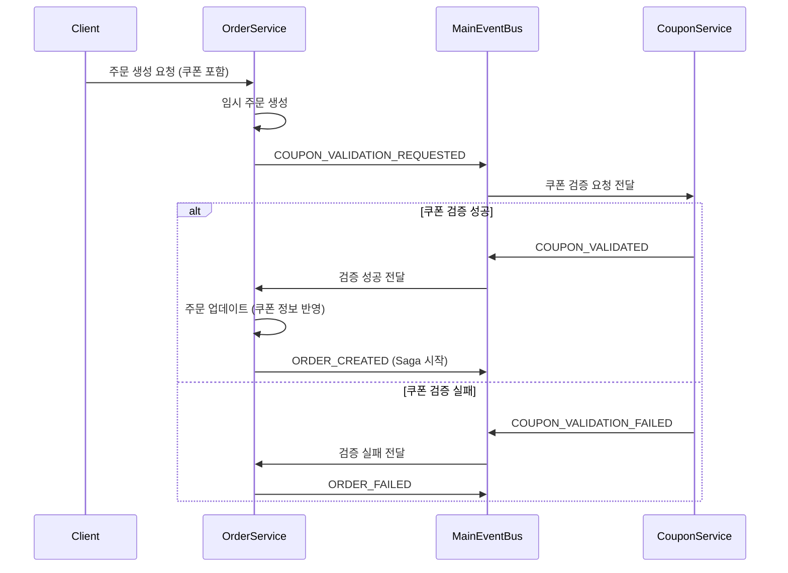

# 🎫 쿠폰 기능 구현 워크플로우

## 📋 프로젝트 개요

**목표**: 기존 Saga Choreography 패턴 구매 시스템에 쿠폰 할인 기능 통합  
**아키텍처**: ✅ **완전한 이벤트 드리븐 아키텍처로 전환 완료**  
**상태**: **Phase 3 완료** - 이벤트 드리븐 쿠폰 검증 시스템 구현 완료

## 🏗️ 시스템 아키텍처 설계

### 새로 추가될 컴포넌트



### 데이터베이스 스키마 설계

```sql
-- 쿠폰 마스터 테이블
CREATE TABLE coupons (
  id UUID PRIMARY KEY DEFAULT uuid_generate_v4(),
  name VARCHAR(100) NOT NULL,
  description TEXT,
  discount_type ENUM('PERCENTAGE', 'FIXED_AMOUNT') NOT NULL,
  discount_value DECIMAL(10,2) NOT NULL,
  min_order_amount DECIMAL(10,2) DEFAULT 0,
  max_discount_amount DECIMAL(10,2), -- 정률 할인 시 최대 할인 금액
  applicable_type ENUM('ALL', 'CATEGORY', 'ITEM') NOT NULL,
  applicable_target_ids TEXT[], -- 카테고리 ID 또는 아이템 ID 배열
  total_quantity INTEGER NOT NULL DEFAULT 0,
  used_quantity INTEGER NOT NULL DEFAULT 0,
  validity_type ENUM('RELATIVE', 'ABSOLUTE') NOT NULL,
  validity_days INTEGER, -- 상대적 유효기간 (N일)
  valid_from TIMESTAMP, -- 절대적 유효기간 시작
  valid_until TIMESTAMP, -- 절대적 유효기간 종료
  is_active BOOLEAN NOT NULL DEFAULT true,
  created_by UUID NOT NULL,
  created_at TIMESTAMP NOT NULL DEFAULT CURRENT_TIMESTAMP,
  updated_at TIMESTAMP NOT NULL DEFAULT CURRENT_TIMESTAMP
);

-- 사용자 쿠폰 테이블
CREATE TABLE user_coupons (
  id UUID PRIMARY KEY DEFAULT uuid_generate_v4(),
  user_id UUID NOT NULL,
  coupon_id UUID NOT NULL REFERENCES coupons(id),
  status ENUM('ACTIVE', 'USED', 'EXPIRED') NOT NULL DEFAULT 'ACTIVE',
  issued_at TIMESTAMP NOT NULL DEFAULT CURRENT_TIMESTAMP, -- 쿠폰이 사용자에게 발급된 시점
  expires_at TIMESTAMP NOT NULL,
  used_at TIMESTAMP,
  used_in_order_id UUID, -- 쿠폰이 실제로 사용된 주문의 ID (추적 및 환불 시 참조용)
  created_at TIMESTAMP NOT NULL DEFAULT CURRENT_TIMESTAMP,
  updated_at TIMESTAMP NOT NULL DEFAULT CURRENT_TIMESTAMP,
  
  UNIQUE(user_id, coupon_id) -- 1인 1회 발급 제한
);

-- 쿠폰 사용 이력 테이블
CREATE TABLE coupon_usage_logs (
  id UUID PRIMARY KEY DEFAULT uuid_generate_v4(),
  user_coupon_id UUID NOT NULL REFERENCES user_coupons(id),
  order_id UUID NOT NULL,
  discount_amount DECIMAL(10,2) NOT NULL, -- 실제 적용된 할인 금액 (계산 결과)
  original_amount DECIMAL(10,2) NOT NULL, -- 할인 적용 전 원래 주문 금액
  final_amount DECIMAL(10,2) NOT NULL, -- 할인 적용 후 최종 결제 금액 (original_amount - discount_amount)
  used_at TIMESTAMP NOT NULL DEFAULT CURRENT_TIMESTAMP
);
```

## 📅 Phase별 구현 로드맵

### Phase 1: 기초 인프라 구축 (Week 1)

#### 1.1 데이터베이스 설계 및 마이그레이션 (2일)
**담당**: Backend Developer  
**예상 시간**: 16시간

**Task 세부사항**:
- [ ] 데이터베이스 스키마 설계 검토
- [ ] TypeORM 마이그레이션 파일 생성
- [ ] 인덱스 설계 (user_id, coupon_id, expires_at 등)
- [ ] 테스트 데이터 시드 작성

**Acceptance Criteria**:
- 모든 테이블이 정상적으로 생성됨
- 외래키 제약조건이 올바르게 설정됨
- 인덱스가 적절히 생성되어 쿼리 성능 최적화됨

#### 1.2 Entity 및 Repository 구현 (2일)
**담당**: Backend Developer  
**예상 시간**: 16시간

**Task 세부사항**:
- [ ] Coupon Entity 구현
- [ ] UserCoupon Entity 구현  
- [ ] CouponUsageLog Entity 구현
- [ ] Repository 클래스 구현
- [ ] Entity 관계 매핑 설정

```typescript
// 예시: Coupon Entity
@Entity('coupons')
export class Coupon {
  @PrimaryGeneratedColumn('uuid')
  id: string;

  @Column({ length: 100 })
  name: string;

  @Column({ type: 'enum', enum: DiscountType })
  discountType: DiscountType;

  @Column({ type: 'decimal', precision: 10, scale: 2 })
  discountValue: number;

  // ... 기타 필드들
}
```

#### 1.3 Coupon EventBus 시스템 구축 (1일)
**담당**: Backend Developer  
**예상 시간**: 8시간

**Task 세부사항**:
- [ ] 별도 CouponEventBusService 구현 (기존 EventBusService와 독립)
- [ ] 쿠폰 전용 Redis 채널 설정
- [ ] 쿠폰 이벤트 타입 정의 (CouponEventType enum)
- [ ] 쿠폰 이벤트 인터페이스 정의

```typescript
// 별도 쿠폰 EventBus 구현
@Injectable()
export class CouponEventBusService {
  private readonly logger = new Logger(CouponEventBusService.name);
  private subscriber: Redis;
  private eventHandlers = new Map<string, ((data: any) => void)[]>();

  constructor(
    @Inject('COUPON_REDIS_CLIENT') private readonly redis: Redis,
    private readonly configService: ConfigService,
  ) {
    // 쿠폰 전용 Redis 인스턴스 설정
    this.initializeCouponEventBus();
  }

  async publishCouponEvent(eventType: CouponEventType, data: any): Promise<void> {
    const channelName = `coupon:${eventType}`;
    await this.redis.publish(channelName, JSON.stringify({
      eventType,
      data,
      timestamp: new Date(),
    }));
  }
}
```

#### 1.4 CouponService 기본 구조 구현 (1일)
**담당**: Backend Developer  
**예상 시간**: 8시간

**Task 세부사항**:
- [ ] CouponService 클래스 생성
- [ ] CouponEventBusService 주입 및 연동
- [ ] 기본 CRUD 메서드 구현
- [ ] DI 컨테이너 설정
- [ ] 기본 유닛 테스트 작성

### Phase 2: 핵심 쿠폰 로직 구현 (Week 2)

#### 2.1 쿠폰 검증 로직 구현 (3일)
**담당**: Backend Developer  
**예상 시간**: 24시간

**Task 세부사항**:
- [ ] 쿠폰 유효성 검증 로직
- [ ] 적용 대상 검증 (카테고리/아이템)
- [ ] 최소 주문 금액 검증
- [ ] 쿠폰 사용 가능 여부 검증

```typescript
async validateCouponUsage(
  userId: string,
  couponId: string,
  orderItems: OrderItem[],
  orderAmount: number
): Promise<CouponValidationResult> {
  // 1. 사용자 쿠폰 보유 여부 확인
  // 2. 쿠폰 만료 여부 확인
  // 3. 적용 대상 상품 포함 여부 확인
  // 4. 최소 주문 금액 조건 확인
  // 5. 쿠폰 재고 확인
}
```

#### 2.2 할인 계산 로직 구현 (2일)
**담당**: Backend Developer  
**예상 시간**: 16시간

**Task 세부사항**:
- [ ] 정률 할인 계산 로직
- [ ] 정액 할인 계산 로직
- [ ] 최대 할인 금액 제한 처리
- [ ] 할인 적용 대상 필터링

```typescript
async calculateDiscount(
  coupon: Coupon,
  orderItems: OrderItem[],
  orderAmount: number
): Promise<DiscountResult> {
  if (coupon.discountType === DiscountType.PERCENTAGE) {
    return this.calculatePercentageDiscount(coupon, orderAmount);
  } else {
    return this.calculateFixedDiscount(coupon, orderAmount);
  }
}
```

### ✅ Phase 3: 기존 시스템 통합 (완료)

#### ✅ 3.1 주문 시스템 이벤트 드리븐 통합 (완료)
**담당**: Backend Developer  
**완료일**: 2025-01-25

**구현 완료된 내용**:
- ✅ OrderService 완전 리팩토링 - 직접 호출 제거
- ✅ 이벤트 드리븐 쿠폰 검증 플로우 구현
- ✅ 쿠폰 검증 성공/실패 처리 로직 구현
- ✅ 주문 실패 시 쿠폰 복원 이벤트 통합

**새로운 이벤트 드리븐 플로우**:
```typescript
// 구현된 OrderService 이벤트 드리븐 플로우
async createOrder(createOrderDto: CreateOrderDto): Promise<Order> {
  // 1. 임시 주문 생성
  const order = this.orderRepository.create({
    id: uuidv4(),
    userId, itemId, quantity,
    totalAmount,
    discountAmount: 0,
    finalAmount: totalAmount,
    userCouponId: null,
    status: OrderStatus.PENDING,
  });
  const savedOrder = await this.orderRepository.save(order);

  if (userCouponId) {
    // 2. 쿠폰 검증 요청 이벤트 발행 (기존 직접 호출 대신)
    await this.eventBus.publish(EventType.COUPON_VALIDATION_REQUESTED, {
      orderId: savedOrder.id,
      userId, itemId, quantity, totalAmount, userCouponId
    });
  } else {
    // 3. 쿠폰 없으면 바로 ORDER_CREATED 이벤트 발행
    await this.eventBus.publish(EventType.ORDER_CREATED, orderCreatedEvent);
  }
}

// 쿠폰 검증 성공 시 처리
private async handleCouponValidated(eventData: CouponValidatedEvent): Promise<void> {
  // 주문에 쿠폰 정보 반영 후 ORDER_CREATED 이벤트 발행
  order.userCouponId = userCouponId;
  order.discountAmount = discountAmount;
  order.finalAmount = finalAmount;
  await this.eventBus.publish(EventType.ORDER_CREATED, orderCreatedEvent);
}
```

#### ✅ 3.2 메인 EventBus와 쿠폰 시스템 통합 (완료)
**담당**: Backend Developer  
**완료일**: 2025-01-25

**구현 완료된 내용**:
- ✅ 메인 EventType enum에 쿠폰 검증 이벤트 추가
- ✅ CouponService에서 메인 EventBus 이벤트 구독 구현
- ✅ 쿠폰 검증 요청 처리 핸들러 구현
- ✅ 주문 실패 시 쿠폰 복원 로직 이벤트 기반으로 구현
- ✅ 모듈 간 의존성 완전 제거 (OrderModule에서 CouponModule import 제거)

**구현된 이벤트 통합 구조**:
```typescript
// src/common/events/event-types.enum.ts - 메인 EventBus에 쿠폰 이벤트 추가
export enum EventType {
  // 기존 이벤트들...
  ORDER_CREATED = 'order.created',
  ORDER_COMPLETED = 'order.completed',
  ORDER_FAILED = 'order.failed',
  
  // ✅ 새로 추가된 쿠폰 관련 이벤트 (Saga 플로우 통합)
  COUPON_VALIDATION_REQUESTED = 'coupon.validation.requested',
  COUPON_VALIDATED = 'coupon.validated',
  COUPON_VALIDATION_FAILED = 'coupon.validation.failed',
}

// CouponService - 메인 EventBus 이벤트 구독
export class CouponService implements OnModuleInit {
  constructor(
    private readonly mainEventBus: EventBusService, // 메인 EventBus 연동
    private readonly couponEventBus: CouponEventBusService, // 쿠폰 전용 EventBus
  ) {}

  async onModuleInit(): Promise<void> {
    // ✅ 쿠폰 검증 요청 이벤트 구독
    await this.mainEventBus.subscribe(
      EventType.COUPON_VALIDATION_REQUESTED,
      this.handleCouponValidationRequested.bind(this)
    );
    
    // 기존 주문 실패 이벤트 구독 (쿠폰 복원용)
    await this.mainEventBus.subscribe(
      EventType.ORDER_FAILED,
      this.handleOrderFailed.bind(this)
    );
  }

  // ✅ 구현된 쿠폰 검증 요청 처리
  private async handleCouponValidationRequested(eventData: CouponValidationRequestedEvent) {
    try {
      // 쿠폰 검증 및 할인 계산
      const discountAmount = userCoupon.coupon.calculateDiscount(totalAmount);
      
      // 성공 시: COUPON_VALIDATED 이벤트 발행
      await this.mainEventBus.publish(EventType.COUPON_VALIDATED, couponValidatedEvent);
    } catch (error) {
      // 실패 시: COUPON_VALIDATION_FAILED 이벤트 발행
      await this.mainEventBus.publish(EventType.COUPON_VALIDATION_FAILED, failedEvent);
    }
  }
}
```

## 🎯 구현 완료: 아키텍처 일관성 달성

### ✅ 주요 성과

**1. 완전한 이벤트 드리븐 아키텍처 전환**
- **문제점**: OrderService가 CouponService를 직접 호출하여 Saga 패턴 위반
- **해결책**: 완전한 이벤트 기반 통신으로 전환
- **결과**: 모든 서비스(User, Order, Inventory, Item, Payment, **Coupon**)가 동일한 패턴 사용

**2. 모듈 간 결합도 최소화**
- OrderModule에서 CouponModule 의존성 완전 제거
- 이벤트 기반 통신으로 느슨한 결합 달성
- 독립적인 배포 및 확장성 확보

**3. 기존 인프라와의 완벽한 통합**
- 기존 쿠폰 EventBus 시스템 유지
- 메인 EventBus와 쿠폰 EventBus 하이브리드 구조 활용
- 도메인 내 이벤트(쿠폰 EventBus) + 도메인 간 이벤트(메인 EventBus) 분리

### 🔄 새로운 이벤트 플로우



### 📁 구현된 파일 구조

```
src/
├── common/events/
│   ├── event-types.enum.ts          ✅ 쿠폰 검증 이벤트 추가
│   └── event-interfaces.ts          ✅ 쿠폰 이벤트 인터페이스 추가
├── modules/
│   ├── order/
│   │   ├── order.service.ts          ✅ 완전 이벤트 드리븐으로 리팩토링
│   │   └── order.module.ts           ✅ CouponModule 의존성 제거
│   └── coupon/
│       └── services/
│           └── coupon.service.ts     ✅ 메인 EventBus 이벤트 구독 추가
```

### Phase 4: API 및 관리자 기능 (Week 3)

#### 4.1 관리자 API 구현 (3일)
**담당**: Backend Developer  
**예상 시간**: 24시간

**Task 세부사항**:
- [ ] 쿠폰 생성 API
- [ ] 쿠폰 수정 API
- [ ] 쿠폰 삭제/비활성화 API
- [ ] 쿠폰 목록 조회 API
- [ ] 쿠폰 통계 API

```typescript
@Controller('admin/coupons')
@UseGuards(AdminGuard)
export class AdminCouponController {
  @Post()
  async createCoupon(@Body() createCouponDto: CreateCouponDto): Promise<Coupon> {
    return this.couponService.createCoupon(createCouponDto);
  }

  @Get(':id/statistics')
  async getCouponStatistics(@Param('id') couponId: string): Promise<CouponStatistics> {
    return this.couponService.getCouponStatistics(couponId);
  }
}
```

#### 4.2 사용자 API 구현 (2일)
**담당**: Backend Developer  
**예상 시간**: 16시간

**Task 세부사항**:
- [ ] 사용자 쿠폰 목록 조회 API
- [ ] 주문 시 적용 가능 쿠폰 조회 API
- [ ] 쿠폰 적용 미리보기 API
- [ ] 쿠폰 사용 내역 조회 API

```typescript
@Controller('coupons')
@UseGuards(AuthGuard)
export class CouponController {
  @Get('my-coupons')
  async getMyCoupons(@GetUser() user: User): Promise<UserCoupon[]> {
    return this.couponService.getUserCoupons(user.id);
  }

  @Post('applicable')
  async getApplicableCoupons(
    @GetUser() user: User,
    @Body() orderDto: OrderPreviewDto
  ): Promise<ApplicableCoupon[]> {
    return this.couponService.getApplicableCoupons(user.id, orderDto);
  }
}
```

### Phase 5: 프론트엔드 구현 (Week 4)

#### 5.1 쿠폰함 페이지 구현 (2일)
**담당**: Frontend Developer  
**예상 시간**: 16시간

**Task 세부사항**:
- [ ] 쿠폰 목록 컴포넌트
- [ ] 쿠폰 카드 UI 컴포넌트
- [ ] 쿠폰 상태별 필터링
- [ ] 쿠폰 만료 임박 표시

#### 5.2 주문 시 쿠폰 적용 UI (2일)
**담당**: Frontend Developer  
**예상 시간**: 16시간

**Task 세부사항**:
- [ ] 결제 페이지 쿠폰 선택 UI
- [ ] 할인 금액 미리보기
- [ ] 쿠폰 적용/해제 토글
- [ ] 할인 내역 표시

#### 5.3 관리자 쿠폰 관리 페이지 (1일)
**담당**: Frontend Developer  
**예상 시간**: 8시간

**Task 세부사항**:
- [ ] 쿠폰 생성 폼
- [ ] 쿠폰 목록 관리
- [ ] 쿠폰 통계 대시보드
- [ ] 쿠폰 수정/삭제 기능

### Phase 6: 테스트 및 배포 준비 (Week 4)

#### 6.1 통합 테스트 (1일)
**담당**: QA + Backend Developer  
**예상 시간**: 8시간

**Task 세부사항**:
- [ ] 쿠폰 적용 E2E 테스트
- [ ] 주문 실패 시 쿠폰 복원 테스트
- [ ] 동시성 테스트 (쿠폰 재고 관리)
- [ ] 성능 테스트

#### 6.2 문서화 및 배포 (1일)
**담당**: 전체 팀  
**예상 시간**: 8시간

**Task 세부사항**:
- [ ] API 문서 작성
- [ ] 운영 가이드 작성
- [ ] 배포 스크립트 준비
- [ ] 모니터링 설정

## 🔧 기술적 고려사항

### 동시성 제어
```typescript
// 쿠폰 재고 차감 시 동시성 제어
async applyCoupon(userId: string, couponId: string): Promise<void> {
  return this.dataSource.transaction(async (manager) => {
    // 쿠폰 조회 및 락
    const coupon = await manager.findOne(Coupon, {
      where: { id: couponId },
      lock: { mode: 'pessimistic_write' }
    });
    
    if (coupon.usedQuantity >= coupon.totalQuantity) {
      throw new CouponOutOfStockException();
    }
    
    // 쿠폰 사용량 증가
    await manager.increment(Coupon, { id: couponId }, 'usedQuantity', 1);
  });
}
```

### 쿠폰 만료 처리
```typescript
// 스케줄러를 통한 쿠폰 만료 처리
@Cron('0 0 * * *') // 매일 자정 실행
async processExpiredCoupons(): Promise<void> {
  const expiredCoupons = await this.userCouponRepository.find({
    where: {
      status: UserCouponStatus.ACTIVE,
      expiresAt: LessThan(new Date())
    }
  });

  for (const userCoupon of expiredCoupons) {
    userCoupon.markAsExpired();
    await this.userCouponRepository.save(userCoupon);
    
    // 만료 이벤트 발행
    await this.eventBus.publish(CouponEventType.COUPON_EXPIRED, {
      userId: userCoupon.userId,
      couponId: userCoupon.couponId
    });
  }
}
```

### 성능 최적화
- **캐싱**: 자주 조회되는 쿠폰 정보는 Redis 캐싱
- **인덱싱**: user_id, expires_at, status 컬럼에 복합 인덱스
- **배치 처리**: 대량 쿠폰 발급 시 배치 처리

## 📊 성공 지표

### ✅ 아키텍처 지표 (달성 완료)
- ✅ **이벤트 드리븐 일관성**: 모든 서비스가 동일한 Saga Choreography 패턴 사용
- ✅ **모듈 결합도**: OrderService-CouponService 간 직접 의존성 완전 제거
- ✅ **확장성**: 독립적인 배포 및 확장 가능한 구조 달성
- ✅ **기존 시스템 호환성**: 기존 EventBus 인프라와 완벽 통합

### 기능적 지표 (구현 대기)
- [ ] 쿠폰 적용률 95% 이상 성공
- [ ] 할인 계산 정확도 100%
- [ ] 쿠폰 재고 관리 정확성 100%

### 성능 지표 (구현 대기)
- [ ] 쿠폰 적용 응답 시간 < 500ms
- [ ] 쿠폰 목록 조회 응답 시간 < 200ms
- [ ] 동시 사용자 1000명 처리 가능

### 안정성 지표 (구현 대기)
- [ ] 쿠폰 관련 버그 제로
- [ ] 데이터 정합성 100%
- [ ] 시스템 가용성 99.9%

## 🚨 위험요소 및 대응 방안

### 높은 위험도
**동시성 문제**: 쿠폰 재고 관리 시 race condition  
**대응방안**: DB 트랜잭션 + Pessimistic Lock 사용

**할인 계산 오류**: 복잡한 할인 로직으로 인한 계산 실수  
**대응방안**: 철저한 유닛 테스트 + 계산 검증 로직

### 중간 위험도
**성능 저하**: 쿠폰 검증 로직으로 인한 주문 처리 지연  
**대응방안**: 캐싱 전략 + 최적화된 쿼리

**데이터 정합성**: 복잡한 이벤트 체인으로 인한 데이터 불일치  
**대응방안**: 보상 트랜잭션 + 정합성 체크 배치

## 📝 추후 확장 계획

### Phase 2 기능 (추후 개발)
- [ ] 쿠폰 코드 입력 기능
- [ ] 자동 쿠폰 발급 시스템
- [ ] 쿠폰 중복 사용 규칙 엔진
- [ ] 추천 시스템 연동
- [ ] A/B 테스트 지원

이 워크플로우는 현재 시스템의 Saga Choreography 패턴과 하이브리드 아키텍처를 유지하면서 쿠폰 기능을 안정적으로 통합할 수 있도록 설계되었습니다. 🎯