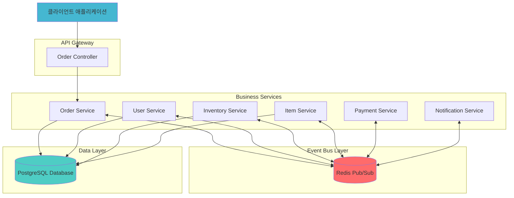
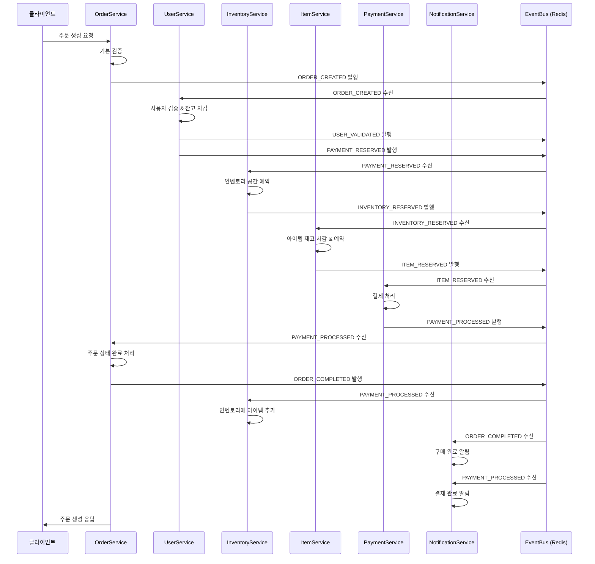
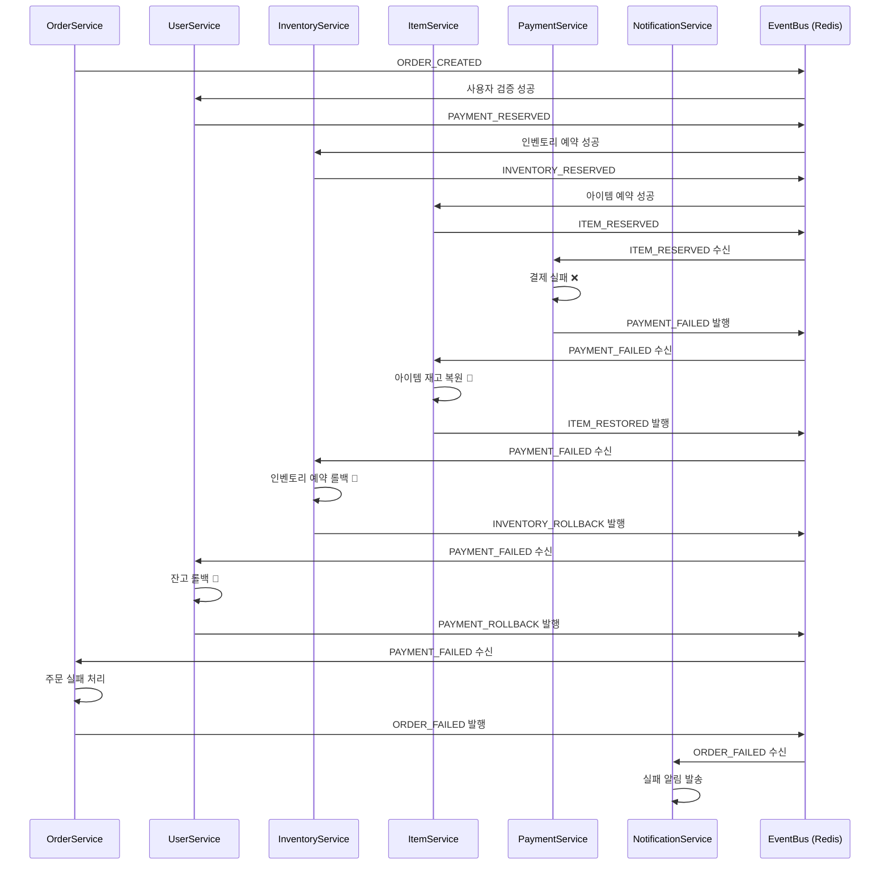
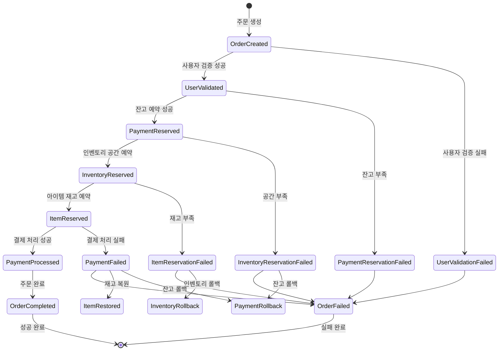

# 구매 시스템 다이어그램

이 문서는 Saga Choreography 패턴으로 구현된 분산 이벤트 기반 구매 시스템의 전체적인 흐름과 각 서비스 간의 상호작용을 다이어그램으로 설명합니다.

## 📋 목차

- [전체 시스템 아키텍처](#전체-시스템-아키텍처)
- [구매 성공 플로우](#구매-성공-플로우)
- [구매 실패 시나리오](#구매-실패-시나리오)
- [이벤트 상태 다이어그램](#이벤트-상태-다이어그램)
- [서비스별 이벤트 매트릭스](#서비스별-이벤트-매트릭스)
- [이벤트 데이터 구조](#이벤트-데이터-구조)
- [이벤트 타입 정리](#이벤트-타입-정리)

## 🏗️ 전체 시스템 아키텍처

**주요 특징:**
- **이벤트 기반 아키텍처**: Redis Pub/Sub을 통한 비동기 통신
- **분산 시스템**: 각 서비스가 독립적으로 동작
- **ACID 보장**: PostgreSQL 트랜잭션을 통한 데이터 일관성
- **느슨한 결합**: 서비스 간 직접 호출 없이 이벤트로 통신

## 🔄 구매 성공 플로우

### 플로우 단계별 설명

1. **주문 생성**: 클라이언트가 주문 요청, 기본 검증 후 ORDER_CREATED 이벤트 발행
2. **사용자 검증**: 사용자 정보, 잔고, 인벤토리 공간 검증 후 잔고 차감
3. **인벤토리 예약**: 인벤토리 공간 검증 및 예약
4. **아이템 예약**: 아이템 재고 확인 및 차감
5. **결제 처리**: 실제 결제 처리 (시뮬레이션)
6. **주문 완료**: 주문 상태를 완료로 변경
7. **아이템 지급**: 사용자 인벤토리에 아이템 추가
8. **알림 발송**: 구매 완료 및 결제 완료 알림 발송

## 🚨 구매 실패 시나리오

### 보상 트랜잭션 (Compensating Transaction)

실패 지점에 따른 롤백 범위:

- **사용자 검증 실패**: 주문만 실패 처리
- **인벤토리 예약 실패**: 잔고 롤백 + 주문 실패
- **아이템 예약 실패**: 인벤토리 예약 해제 + 잔고 롤백 + 주문 실패  
- **결제 실패**: 아이템 재고 복원 + 인벤토리 롤백 + 잔고 롤백 + 주문 실패

## 📊 이벤트 상태 다이어그램

## 🔄 서비스별 이벤트 매트릭스

```mermaid
graph TB
    subgraph "이벤트 발행자"
        OS[OrderService]
        US[UserService]
        IS[InventoryService]
        ITS[ItemService]
        PS[PaymentService]
        NS[NotificationService]
    end
    
    subgraph "이벤트"
        OC[ORDER_CREATED]
        UV[USER_VALIDATED]
        PR[PAYMENT_RESERVED]
        IR[INVENTORY_RESERVED]
        ITR[ITEM_RESERVED]
        PP[PAYMENT_PROCESSED]
        OCP[ORDER_COMPLETED]
        
        UVF[USER_VALIDATION_FAILED]
        IRF[INVENTORY_RESERVATION_FAILED]
        ITRF[ITEM_RESERVATION_FAILED]
        PF[PAYMENT_FAILED]
        OF[ORDER_FAILED]
        
        PRB[PAYMENT_ROLLBACK]
        IRB[INVENTORY_ROLLBACK]
        ITRST[ITEM_RESTORED]
        NST[NOTIFICATION_SENT]
    end
    
    subgraph "이벤트 구독자"
        US2[UserService]
        IS2[InventoryService]
        ITS2[ItemService]
        PS2[PaymentService]
        OS2[OrderService]
        IS3[InventoryService]
        NS2[NotificationService]
    end
    
    %% 성공 플로우
    OS --> OC
    OC --> US2
    US --> UV
    US --> PR
    PR --> IS2
    IS --> IR
    IR --> ITS2
    ITS --> ITR
    ITR --> PS2
    PS --> PP
    PP --> OS2
    PP --> IS3
    OS --> OCP
    OCP --> NS2
    
    %% 실패 플로우 연결 (일부만 표시)
    US --> UVF
    IS --> IRF
    ITS --> ITRF
    PS --> PF
    OS --> OF
    
    style OC fill:#e1f5fe
    style PP fill:#c8e6c9
    style PF fill:#ffcdd2
    style OF fill:#ffcdd2
```

## 📋 이벤트 데이터 구조

```mermaid
classDiagram
    class BaseEventData {
        +String orderId
        +String userId
        +Date timestamp
    }
    
    class OrderCreatedEvent {
        +String itemId
        +Number quantity
        +Number totalAmount
    }
    
    class UserValidatedEvent {
        +Number userBalance
        +Number requiredAmount
    }
    
    class PaymentReservedEvent {
        +Number reservedAmount
        +Number remainingBalance
    }
    
    class InventoryReservedEvent {
        +String itemId
        +Number reservedSlots
        +Number availableSlots
    }
    
    class ItemReservedEvent {
        +String itemId
        +Number reservedQuantity
        +Number remainingStock
    }
    
    class PaymentProcessedEvent {
        +Number paymentAmount
        +String paymentMethod
    }
    
    class OrderCompletedEvent {
        +String itemName
        +Number totalAmount
    }
    
    class PaymentFailedEvent {
        +String reason
        +Number attemptedAmount
    }
    
    class OrderFailedEvent {
        +String reason
        +String failedStep
    }
    
    class NotificationEvent {
        +String message
        +String type
    }
    
    BaseEventData <|-- OrderCreatedEvent
    BaseEventData <|-- UserValidatedEvent
    BaseEventData <|-- PaymentReservedEvent
    BaseEventData <|-- InventoryReservedEvent
    BaseEventData <|-- ItemReservedEvent
    BaseEventData <|-- PaymentProcessedEvent
    BaseEventData <|-- OrderCompletedEvent
    BaseEventData <|-- PaymentFailedEvent
    BaseEventData <|-- OrderFailedEvent
    BaseEventData <|-- NotificationEvent
```

## 📝 이벤트 타입 정리

### 주문 관련 이벤트
| 이벤트 타입 | 설명 | 발행자 | 구독자 |
|------------|------|-------|-------|
| `ORDER_CREATED` | 주문 생성 (Saga 시작점) | OrderService | UserService |
| `ORDER_COMPLETED` | 주문 완료 | OrderService | NotificationService |
| `ORDER_FAILED` | 주문 실패 | OrderService | NotificationService |

### 사용자/결제 관련 이벤트
| 이벤트 타입 | 설명 | 발행자 | 구독자 |
|------------|------|-------|-------|
| `USER_VALIDATED` | 사용자 검증 완료 | UserService | - |
| `USER_VALIDATION_FAILED` | 사용자 검증 실패 | UserService | OrderService |
| `PAYMENT_RESERVED` | 결제 예약 완료 | UserService | InventoryService |
| `PAYMENT_PROCESSED` | 결제 처리 완료 | PaymentService | OrderService, InventoryService, NotificationService |
| `PAYMENT_FAILED` | 결제 실패 | PaymentService | ItemService, InventoryService, UserService, OrderService, NotificationService |
| `PAYMENT_ROLLBACK` | 결제 롤백 | UserService | - |

### 인벤토리 관련 이벤트
| 이벤트 타입 | 설명 | 발행자 | 구독자 |
|------------|------|-------|-------|
| `INVENTORY_RESERVED` | 인벤토리 공간 예약 완료 | InventoryService | ItemService |
| `INVENTORY_RESERVATION_FAILED` | 인벤토리 예약 실패 | InventoryService | UserService, OrderService |
| `INVENTORY_ROLLBACK` | 인벤토리 롤백 | InventoryService | - |

### 아이템 관련 이벤트
| 이벤트 타입 | 설명 | 발행자 | 구독자 |
|------------|------|-------|-------|
| `ITEM_RESERVED` | 아이템 재고 예약 완료 | ItemService | PaymentService |
| `ITEM_RESERVATION_FAILED` | 아이템 예약 실패 | ItemService | InventoryService, UserService, OrderService |
| `ITEM_RESTORED` | 아이템 재고 복원 | ItemService | - |

### 알림 관련 이벤트
| 이벤트 타입 | 설명 | 발행자 | 구독자 |
|------------|------|-------|-------|
| `NOTIFICATION_SENT` | 알림 발송 완료 | NotificationService | - |

## 🔐 동시성 제어

### DB 트랜잭션 기반 동시성 제어
- **Pessimistic Locking**: `SELECT ... FOR UPDATE`
- **트랜잭션 격리**: ACID 보장
- **원자적 연산**: 재고 차감/복원을 원자적으로 처리

### Redis 예약 시스템
- **TTL 기반**: 5분 만료 시간
- **예약 키 패턴**: `{type}_reserve:{userId}:{orderId}`
- **용도**: 단계 간 임시 데이터 전달

## 📊 시스템 특징

### ✅ 장점
- **분산 시스템**: 각 서비스가 독립적으로 동작
- **신뢰성**: 실패 시 자동 롤백
- **확장성**: 각 서비스별 독립 스케일링 가능
- **관측 가능성**: 모든 단계별 상세 로그
- **느슨한 결합**: 이벤트를 통한 서비스 간 통신

### ⚠️ 고려사항
- **최종 일관성**: 분산 시스템 특성상 일시적 불일치 가능
- **이벤트 순서**: 네트워크 지연으로 인한 순서 변경 가능성
- **중복 처리**: 이벤트 중복 수신에 대한 멱등성 보장 필요
- **장애 복구**: 서비스 장애 시 이벤트 유실 방지 필요

---

**Note**: 이 다이어그램들은 Mermaid 형식으로 작성되었습니다. GitHub, GitLab, 또는 [Mermaid Live Editor](https://mermaid.live/)에서 시각화하여 확인할 수 있습니다.