# 구매 시스템 다이어그램

이 문서는 Saga Choreography 패턴으로 구현된 분산 이벤트 기반 구매 시스템의 전체적인 흐름과 각 서비스 간의 상호작용을 다이어그램으로 설명합니다.

## 📋 목차

- [전체 시스템 아키텍처](#전체-시스템-아키텍처)
- [구매 성공 플로우](#구매-성공-플로우)
- [구매 실패 시나리오](#구매-실패-시나리오)
- [이벤트 상태 다이어그램](#이벤트-상태-다이어그램)
- [서비스별 이벤트 매트릭스](#서비스별-이벤트-매트릭스)
- [이벤트 데이터 구조](#이벤트-데이터-구조)
- [이벤트 타입 정리](#이벤트-타입-정리)

## 🏗️ 전체 시스템 아키텍처

```mermaid
graph TB
    Client[클라이언트 애플리케이션]
    
    subgraph "API Gateway"
        OrderController[Order Controller]
    end
    
    subgraph "Event Bus Layer"
        Redis[(Redis Pub/Sub)]
    end
    
    subgraph "Business Services"
        OrderService[Order Service]
        UserService[User Service] 
        InventoryService[Inventory Service]
        ItemService[Item Service]
        PaymentService[Payment Service]
        NotificationService[Notification Service]
    end
    
    subgraph "Data Layer"
        PostgreSQL[(PostgreSQL Database)]
    end
    
    Client --> OrderController
    OrderController --> OrderService
    
    OrderService <--> Redis
    UserService <--> Redis
    InventoryService <--> Redis
    ItemService <--> Redis
    PaymentService <--> Redis
    NotificationService <--> Redis
    
    OrderService --> PostgreSQL
    UserService --> PostgreSQL
    InventoryService --> PostgreSQL
    ItemService --> PostgreSQL
    
    style Redis fill:#ff6b6b
    style PostgreSQL fill:#4ecdc4
    style Client fill:#45b7d1
```

**주요 특징:**
- **이벤트 기반 아키텍처**: Redis Pub/Sub을 통한 비동기 통신
- **분산 시스템**: 각 서비스가 독립적으로 동작
- **ACID 보장**: PostgreSQL 트랜잭션을 통한 데이터 일관성
- **느슨한 결합**: 서비스 간 직접 호출 없이 이벤트로 통신

## 🔄 구매 성공 플로우

### 플로우 단계별 설명

1. **주문 생성**: 클라이언트가 주문 요청, 기본 검증 후 ORDER_CREATED 이벤트 발행
2. **사용자 검증**: 사용자 정보, 잔고, 인벤토리 공간 검증 후 잔고 차감
3. **인벤토리 예약**: 인벤토리 공간 검증 및 예약
4. **아이템 예약**: 아이템 재고 확인 및 차감
5. **결제 처리**: 실제 결제 처리 (시뮬레이션)
6. **주문 완료**: 주문 상태를 완료로 변경
7. **아이템 지급**: 사용자 인벤토리에 아이템 추가
8. **알림 발송**: 구매 완료 및 결제 완료 알림 발송

## 🚨 구매 실패 시나리오

```mermaid
sequenceDiagram
    participant Order as OrderService
    participant User as UserService
    participant Inventory as InventoryService
    participant Item as ItemService
    participant Payment as PaymentService
    participant Notification as NotificationService
    participant EventBus as EventBus (Redis)

    %% 결제 실패 시나리오
    Order->>EventBus: ORDER_CREATED
    EventBus->>User: 사용자 검증 성공
    User->>EventBus: PAYMENT_RESERVED
    EventBus->>Inventory: 인벤토리 예약 성공
    Inventory->>EventBus: INVENTORY_RESERVED
    EventBus->>Item: 아이템 예약 성공
    Item->>EventBus: ITEM_RESERVED
    
    EventBus->>Payment: ITEM_RESERVED 수신
    Payment->>Payment: 결제 실패 ❌
    Payment->>EventBus: PAYMENT_FAILED 발행
    
    %% 보상 트랜잭션 시작
    EventBus->>Item: PAYMENT_FAILED 수신
    Item->>Item: 아이템 재고 복원 🔄
    Item->>EventBus: ITEM_RESTORED 발행
    
    EventBus->>Inventory: PAYMENT_FAILED 수신
    Inventory->>Inventory: 인벤토리 예약 롤백 🔄
    Inventory->>EventBus: INVENTORY_ROLLBACK 발행
    
    EventBus->>User: PAYMENT_FAILED 수신
    User->>User: 잔고 롤백 🔄
    User->>EventBus: PAYMENT_ROLLBACK 발행
    
    EventBus->>Order: PAYMENT_FAILED 수신
    Order->>Order: 주문 실패 처리
    Order->>EventBus: ORDER_FAILED 발행
    
    EventBus->>Notification: ORDER_FAILED 수신
    Notification->>Notification: 실패 알림 발송
```

### 보상 트랜잭션 (Compensating Transaction)

실패 지점에 따른 롤백 범위:

- **사용자 검증 실패**: 주문만 실패 처리
- **인벤토리 예약 실패**: 잔고 롤백 + 주문 실패
- **아이템 예약 실패**: 인벤토리 예약 해제 + 잔고 롤백 + 주문 실패  
- **결제 실패**: 아이템 재고 복원 + 인벤토리 롤백 + 잔고 롤백 + 주문 실패

## 📊 이벤트 상태 다이어그램

```mermaid
stateDiagram-v2
    [*] --> OrderCreated: 주문 생성
    
    OrderCreated --> UserValidated: 사용자 검증 성공
    OrderCreated --> UserValidationFailed: 사용자 검증 실패
    
    UserValidated --> PaymentReserved: 잔고 예약 성공
    UserValidated --> PaymentReservationFailed: 잔고 부족
    
    PaymentReserved --> InventoryReserved: 인벤토리 공간 예약
    PaymentReserved --> InventoryReservationFailed: 공간 부족
    
    InventoryReserved --> ItemReserved: 아이템 재고 예약
    InventoryReserved --> ItemReservationFailed: 재고 부족
    
    ItemReserved --> PaymentProcessed: 결제 처리 성공
    ItemReserved --> PaymentFailed: 결제 처리 실패
    
    PaymentProcessed --> OrderCompleted: 주문 완료
    
    UserValidationFailed --> OrderFailed
    PaymentReservationFailed --> OrderFailed
    InventoryReservationFailed --> OrderFailed
    ItemReservationFailed --> OrderFailed
    PaymentFailed --> OrderFailed
    
    OrderCompleted --> [*]: 성공 완료
    OrderFailed --> [*]: 실패 완료
    
    %% 보상 트랜잭션
    PaymentFailed --> ItemRestored: 재고 복원
    ItemReservationFailed --> InventoryRollback: 인벤토리 롤백
    InventoryReservationFailed --> PaymentRollback: 잔고 롤백
    PaymentFailed --> PaymentRollback: 잔고 롤백
```

## 🔄 서비스별 이벤트 매트릭스

## 📋 이벤트 데이터 구조

## 📝 이벤트 타입 정리

### 주문 관련 이벤트
| 이벤트 타입 | 설명 | 발행자 | 구독자 |
|------------|------|-------|-------|
| `ORDER_CREATED` | 주문 생성 (Saga 시작점) | OrderService | UserService |
| `ORDER_COMPLETED` | 주문 완료 | OrderService | NotificationService |
| `ORDER_FAILED` | 주문 실패 | OrderService | NotificationService |

### 사용자/결제 관련 이벤트
| 이벤트 타입 | 설명 | 발행자 | 구독자 |
|------------|------|-------|-------|
| `USER_VALIDATED` | 사용자 검증 완료 | UserService | - |
| `USER_VALIDATION_FAILED` | 사용자 검증 실패 | UserService | OrderService |
| `PAYMENT_RESERVED` | 결제 예약 완료 | UserService | InventoryService |
| `PAYMENT_PROCESSED` | 결제 처리 완료 | PaymentService | OrderService, InventoryService, NotificationService |
| `PAYMENT_FAILED` | 결제 실패 | PaymentService | ItemService, InventoryService, UserService, OrderService, NotificationService |
| `PAYMENT_ROLLBACK` | 결제 롤백 | UserService | - |

### 인벤토리 관련 이벤트
| 이벤트 타입 | 설명 | 발행자 | 구독자 |
|------------|------|-------|-------|
| `INVENTORY_RESERVED` | 인벤토리 공간 예약 완료 | InventoryService | ItemService |
| `INVENTORY_RESERVATION_FAILED` | 인벤토리 예약 실패 | InventoryService | UserService, OrderService |
| `INVENTORY_ROLLBACK` | 인벤토리 롤백 | InventoryService | - |

### 아이템 관련 이벤트
| 이벤트 타입 | 설명 | 발행자 | 구독자 |
|------------|------|-------|-------|
| `ITEM_RESERVED` | 아이템 재고 예약 완료 | ItemService | PaymentService |
| `ITEM_RESERVATION_FAILED` | 아이템 예약 실패 | ItemService | InventoryService, UserService, OrderService |
| `ITEM_RESTORED` | 아이템 재고 복원 | ItemService | - |

### 알림 관련 이벤트
| 이벤트 타입 | 설명 | 발행자 | 구독자 |
|------------|------|-------|-------|
| `NOTIFICATION_SENT` | 알림 발송 완료 | NotificationService | - |

## 🔐 동시성 제어

### DB 트랜잭션 기반 동시성 제어
- **Pessimistic Locking**: `SELECT ... FOR UPDATE`
- **트랜잭션 격리**: ACID 보장
- **원자적 연산**: 재고 차감/복원을 원자적으로 처리

### Redis 예약 시스템
- **TTL 기반**: 5분 만료 시간
- **예약 키 패턴**: `{type}_reserve:{userId}:{orderId}`
- **용도**: 단계 간 임시 데이터 전달

## 📊 시스템 특징

### ✅ 장점
- **분산 시스템**: 각 서비스가 독립적으로 동작
- **신뢰성**: 실패 시 자동 롤백
- **확장성**: 각 서비스별 독립 스케일링 가능
- **관측 가능성**: 모든 단계별 상세 로그
- **느슨한 결합**: 이벤트를 통한 서비스 간 통신

### ⚠️ 고려사항
- **최종 일관성**: 분산 시스템 특성상 일시적 불일치 가능
- **이벤트 순서**: 네트워크 지연으로 인한 순서 변경 가능성
- **중복 처리**: 이벤트 중복 수신에 대한 멱등성 보장 필요
- **장애 복구**: 서비스 장애 시 이벤트 유실 방지 필요

---

**Note**: 이 다이어그램들은 Mermaid 형식으로 작성되었습니다. GitHub, GitLab, 또는 [Mermaid Live Editor](https://mermaid.live/)에서 시각화하여 확인할 수 있습니다.